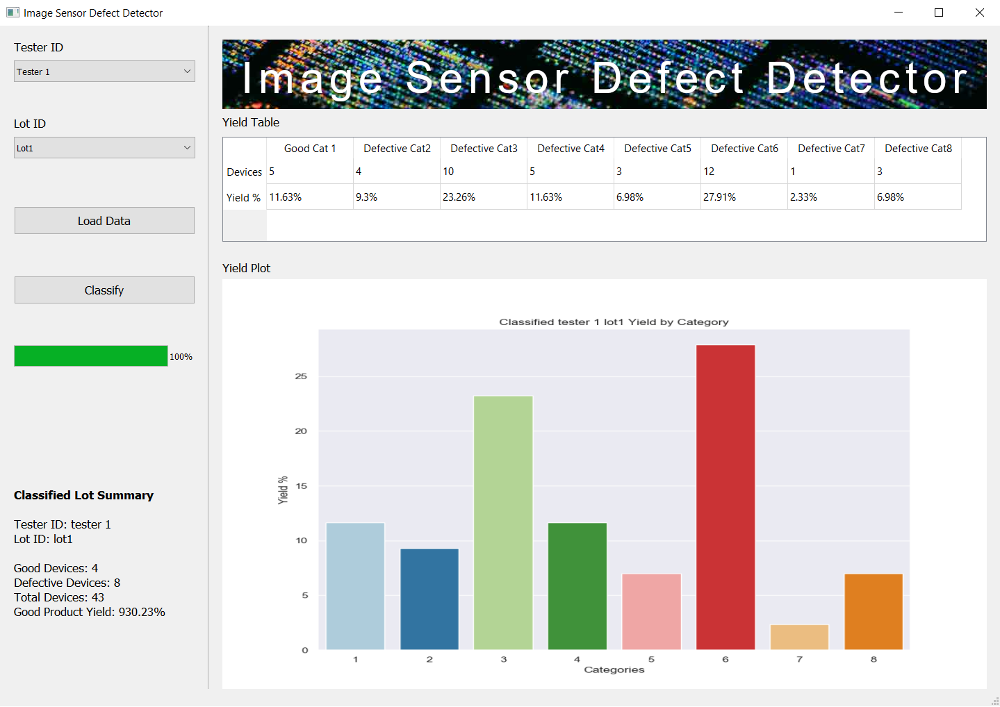

# Image Sensor Defect Finder
##  Project Overview
Image processing and application is a fast growing trend in recent years. This trend got the interest of many semiconductor manufacturing companies to make image sensors (CCD / CMOS) to tap the sensor market share. Application of image sensors could range from cheap toys to satellite. Price and quality of the sensor varies depending on which application specification its being manufactured, price can range from few cents to couple of thousand dollars depends. This project tackles the quality aspect of the image sensor thus saving cost on defect finding process flow and prevents defective sensors reaching high sensitive applications such as medical instruments, autonomous vehicles or aerospace equipments.  

**Image sensor application layers in a vision system**

 Photo credit: thinklucid.com

The complexity of manufacturing image sensor is very high compared to other sensors due to the nature of exposed delicate optical components and wafer die are prone to environmental elements, contaminated recipe materials or manufacturing equipment malfunction. 

**CMOS Image sensor main components**

 Photo credit: thinklucid.com

During image sensor manufacturing phase, sensors has to go through testing process to ensure the quality and reliability.  

**Image sensor pixel plane**

 Photo credit: thinklucid.com

Each images sensor tested produce megabyte worth of various kind of data and one of them is image during testing process. There are many strict control work flows introduced by various teams involved minimise, eliminate or track quality compromising scenarios. One of the scenario is that testing process yield for high cost batch of products falling below the estimated yield, which is an anomaly and expensive one if it is false. False anomalies are flagged when instruments in testing platform malfunctions or human error by manufacturing operations staff. In such scenario a trained staff has to check each image data manually to confirm the flagged batch is indeed an anomaly thus appropriate team can make decision how to proceed with that batch of products if not anomaly batch could be moved to next process as per normal flow.

## Problem Statement
Observed that conducting such task during night shift results in staff couldn’t able to perform the task for long hours due to eyes getting tired and feeling sleepy. 
Results are 
-	An unreliable work flow that causes delay in daily product output delivery to customer.
-	Quality of the product compromised due to misclassification of defects and product with defect escapes as good product and reaching sensitive end products.
-	When good products are classified as defective cost of wastage increases.  

Scope of the project is to build a reliable system to replace the manual image checking work flow.

## Project outcome score and measurement

|Score|Measurement|Outcome|
|------|------|------|
|   0  | Failed|Defective category data misclassified to good category (C1) |
|   1  | Passed|Classified to good category(C1) only contains good category data |
|   2  | Passed|None of good catrgory data classified to defective category and good category(C1) only contains good category data |  

**`Score 0`**: Defective products should not be misclassified as good products and shipped to customer. This will compromise quality of the product delivered and integrity of the business.  

Example:  

| - | Predicted good category(C1) | Defective Categories(C2,C3,C4,C5,C6,C7,C8) |
|------|------|------|
|Actual good category  | C1 | -- |
| Actual Defective Categories | C2,C3 | C2,C3,C4,C5,C6,C7,C8 |

**`Score 1`**: Shipped products are guaranteed good products, no misclassification of defective products in the batch delivered. This ensures good quality of the product delivered and integrity of the business.  

Example:  

| - | Predicted good category(C1) | Defective Categories(C2,C3,C4,C5,C6,C7,C8) |
|------|------|------|
|Actual good category  | C1 | C1 |
| Actual Defective Categories |--   | C2,C3,C4,C5,C6,C7,C8 |  

**`Score 2`**: No good products misclassified as defective and no defective products are misclassified as good either. This ensures good quality of the product delivered and integrity of the business, on top of that cost of good products scrapped as defective products is saved. This score indicates there is no wastage in good products.  

Example:  

| - | Predicted good category(C1) | Defective Categories(C2,C3,C4,C5,C6,C7,C8) |
|------|------|------|
|Actual good category  | C1 | -- |
| Actual Defective Categories |--   | C2,C3,C4,C5,C6,C7,C8 |  

## Technology selection
There were two technology path to take when it comes to building a model to classify image data:
-	Machine Learning
-	Deep Learning  

Machine learning triumphed Deep learning when if come down to interpretability of the outcome. In machine learning outcome can be interpreted by the features selected to use. And features can be optimized or new features can be introduced.  

In this case If one decided to do further failure analysis on the defective products data the features can be useful tools to explain or visualize the failures.

## Feature Selection
### Local Binary Pattern (LBP)
Local Binary Pattern (LBP) is a simple yet very efficient texture operator which labels the pixels of an image by thresholding the neighborhood of each pixel and considers the result as a binary number. It was first described in 1994 (LBP) and has since been found to be a powerful feature for texture classification.

 Photo credit: https://towardsdatascience.com/face-recognition-how-lbph-works-90ec258c3d6b

### Gabor filter
In image processing, a Gabor filter, named after Dennis Gabor, is a linear filter used for texture analysis, which means that it basically analyzes whether there are any specific frequency content in the image in specific directions in a localized region around the point or region of analysis.  

 Photo credit: https://en.wikipedia.org/wiki/Gabor_filter

### Co-occurrence matrix
The graylevel co-occurrence matrix approach also frequently called the spatial gray level dependence matrix (SGLDM) approach is based on studies of the statistics of pixel intensity distributions. As hinted above with regard to the variance in pixel intensity values, single pixel statistics do not provide rich enough descriptions of textures for practical applications. Thus it is natural to consider the second-order statistics obtained by considering pairs of pixels in certain spatial relations to each other.

 Photo credit: https://www.mathworks.com/help/images/create-a-gray-level-co-occurrence-matrix.html

## Classification model selection

Selected features were used to fit trained to following classification models, best estimator prameters were obtained using grid search and predicted using test data:
-	Logistic Regression
-	K Nearest Neighbour classifier
-	Decision Tree Classifier
-	Random Forrest Classifier
-	Extra Tree Classifier
-	Support Vector Machines

Extra Tree Classifier and Support Vector Machine models had good category(C1) accuracy of 100% and f1 score of 1 with over all accuracy at 99.9%.  

During unseen data prediction test `Support Vector Machine` model `good category(C1) accuracy of 100%` and `Score 2` from the Project outcome score and measurement table.

## Conclusion
Support Vector Machine model performed better than other model during model training and unseen data prediction. LBP filter, Gabor filter and co-occurrence matrix features are appropriate and adequate for the success of the model.    
For the problem statement able to make an automated image classifier system to replace manual image classifying process successfully. 

## Further exploration
In future a deep learning model to be built and tested against machine learning model. 

## Deployment
Deployed as a standalone software suitble for industrial machines. PyQt5 package was used to build the GUI for the software.

